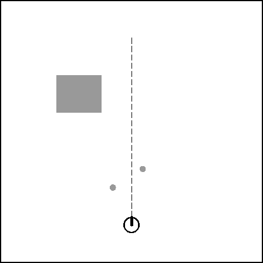
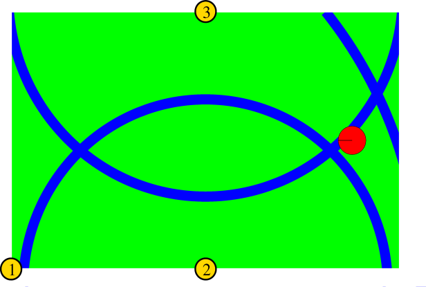

# SUSTech CS401 Intelligent Robot

## Locomotion Kinemaatics

 - Simulate the kinematics of a robot with a differential drive
 - Simulate the motion control of a robot with a differential drive and show the resulting paths w.r.t. different control laws

## Sensors

 - Simulate the process of mapping of a room by using a moving range sensor which knows its location accurately (randomly walking, or moving along a circle).
 - Simulate the process of localization with GPS signals. When sender-receiver clocks are either synchronized or not synchronized, how many satellites are needed to achieve 3D accurate positions, respectively?

## Probabilistic Motion Models

 - Generate samples of the odometry-based motion model (N=500).
 - Generate samples of the velocity-based motion model for following cases (N=500).
 - Generate the map-consistent probability model in the following situation.

## Probabilistic Sensor Models
 - Generate the beam-based measurement models with a mixture of four distributions (by choosing five different sets of parameters).
 - Given the following map, please generate scan measurement probability model and the beam measurement probability model.
 
 - Generate the following landmark measurement probability model by using 3 ranging sensors.
 